# GVE Devnet Webex Instant Connect with Video Device

Sample code that demonstrates the use of Webex Instant Connect (IC) for obtaining and sharing links to live video sessions and also shows how to 
extract the meeting SIP URI from the temporary space that IC creates so that a provider of health services or "host" can join or "dial in" from an associated Webex Room or Desk device. 
It also shows how you can add another Webex user to the temporary space so that they can also join the session without the IC meeting link 
by "dialing in" with the extracted SIP URI for the session and be automatically admitted since they are already part of the space.

## Contacts
* Gerardo Chaves (gchaves@cisco.com)

## Solution Components
* Webex
* Webex Instant Connect
* Webex Room or Desk device

## Requirements  
* Python 3.6 or later  


## Prerequisites
Webex instant connect subscription:  https://instant.webex.com/  
NOTE: To complete this prerequisite you will need to login on instant.webex.com using your organization's admin credentials and then click on the "Activate Instant Connect" button to obtain the proper "Audience" string needed for the installation step below.  

## Installation/Configuration

  - Setup the following environmental variables in the .env file:  
        `IC_API_URL` is the URL for the Webex Instant Connect API (default value is https://mtg-broker-a.wbx2.com/api/v1/joseencrypt )   
        `IC_SPACE_API_URL` is the URL for the Webex Instant Connect space API (default value is https://mtg-broker-a.wbx2.com/api/v1/space )   
        `IC_AUDIENCE` is the "Audience" string provided to you when you register to use the Instant Connect Service  
        `IC_ACCESS_TOKEN` is a valid Webex Access token from the organization you register to use Instant Connect. You can use the access token of a bot you create in your organization. More details on creating a bot and obtaining the access token here: https://developer.webex.com/docs/bots  
        `IC_URL_DURATION` is the the expiration time given as the number of seconds from the Unix Epoch (1970-01-01T00:00:00Z UTC) on or after which the JWT will not be accepted for processing. If not specified will be set for 15 minutes later than the time when the request was made    
        `IC_BASE_SUBJECT`  A unique value in your organization which will be used to place hosts and guests into the same collaboration space. This claim may contain only letters, numbers, and hyphens. This value is mandatory.   
        `IC_HOST_BASEURL` is the base URL to use with Instant Connect for the health provider or "host" without a need to log in.  Check the Instant Connect documentation for current values (default value is https://instant.webex.com/hc/v1/login?int=jose&v=1&data=)  
        `IC_AGENT_BASEURL` is the base URL to use with Instant Connect to force the host to log into Webex.  Check the Instant Connect documentation for current values (default value is https://instant.webex.com/hc/v1/login?&fli=true&int=jose&data=)  
        `IC_CLIENT_BASEURL` is the base URL to use with Instant Connect to use with the Guest without a need to log in. Check the Instant Connect documentation for current values (default value is https://instant.webex.com/hc/v1/talk?int=jose&data= )  
 
  - Install the required python libraries in your environment:  
``` pip3 install -r requirements.txt```  


## Usage

Run app.py:  

```python3 app.py```  

Browse to the URL where the flask aplication is running (i.e. http://127.0.0.1:5000/ ) . You will be presented with a page where you can edit the base subject to be used 
(originally populated from the .env file) and then click on "Generate Links" to get started. The base subject cannot be blank.   
If you wish to add a Webex user to the temporary space so they can join the session with their personal device, specify their Webex ID in the text field before clicking on Generate Links


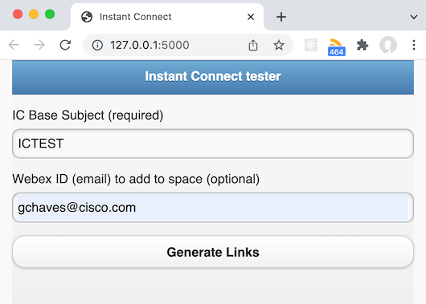


You will be re-directed to a page that displays all the information you need to start the Instant Connect session, including the SIP URI for the Webex Device
 to dial into.  

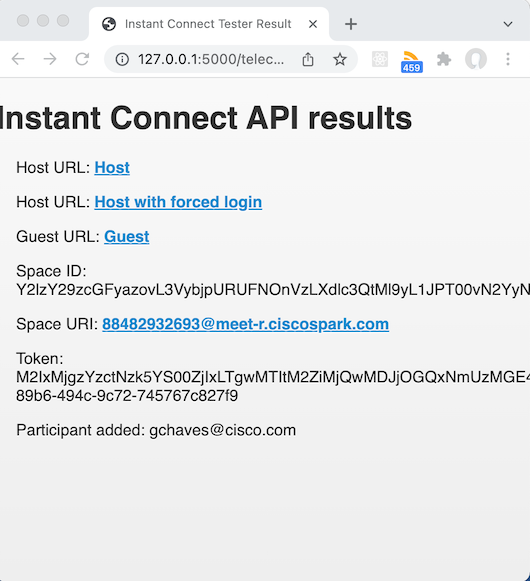

Open the Guest URL in a new browser window (copying the link a pasting it into the address bar of a different browser is preferred) and you will see the initial page where the patient can wait for the session to be initiated by the provider/host (waiting room):  
  
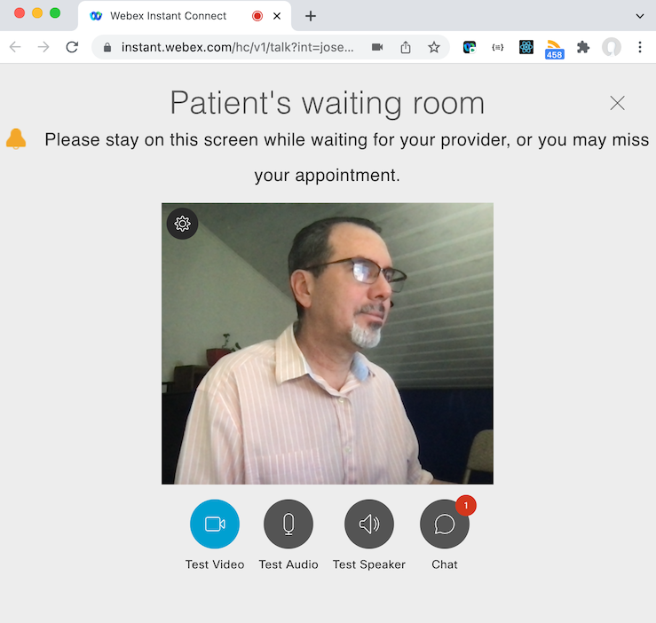

Open the Host URL, which is meant for the healthcare provider, in a new browser window (copying the link a pasting it into the address bar of a different browser is preferred) and you will be re-directed to the login options page:  

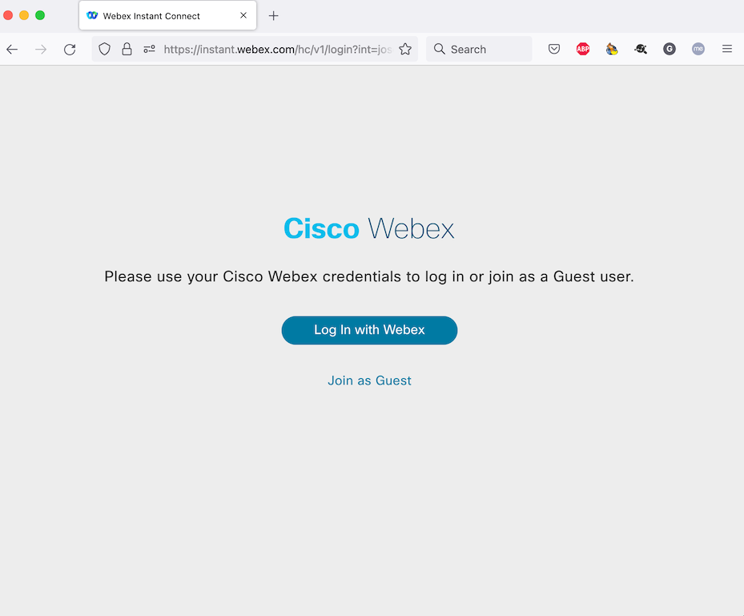

Select "Log In with Webex" to proceed to the login page.  
  
NOTE: If you use the "Host with forced login" link from the Instant Connect API results page, you will not be given the option to have the provider "Join as Guest" and will just obtain the login page.

If you log in using the provider's Webex credentials (login page will vary depending on if the Webex organization they belong to has directory integration enabled) you will get the following confirmation page in case you want Instant Connect to remember the login:  

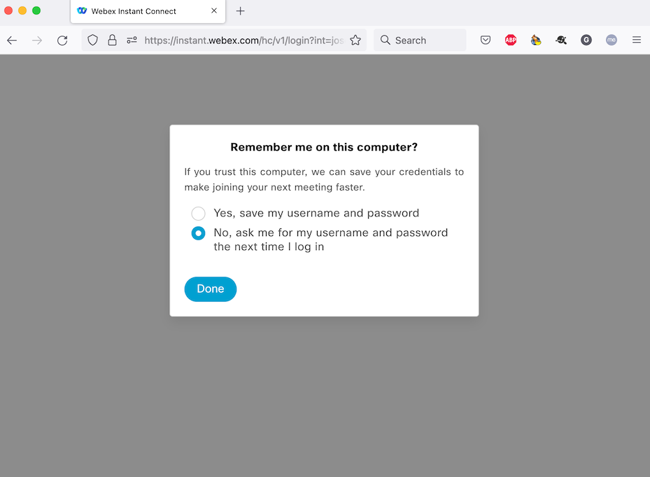
  
The following page reflects what you see if you log in with a Webex account, if you are logging in with a guest provider you will see something similiar but without the avatar icon on the upper right.  
This page reminds you to give the browser permissions to use your camera and microphone so it can join the session, patients also get a similar page as they try to join since the underlying WebRTC component of the browser being used always has to ask permission for camera/microphone use unless you cofigure it ahead of time to always allow camera/microphone usage from the instant.webex.com site  


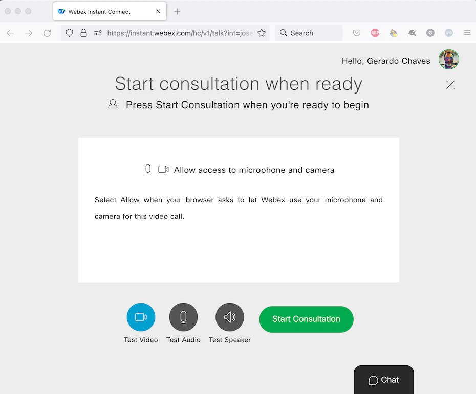

Once the camera permissions are sorted out, the provider is ready to start the consultation session:  

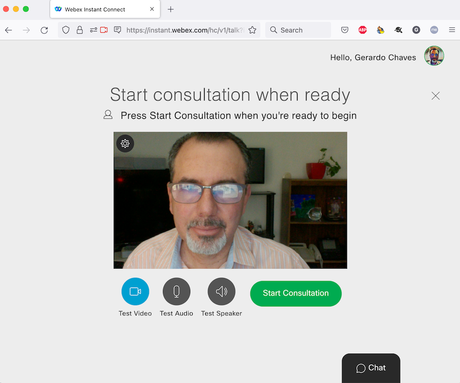

If both the provider and patient join using the URLs provided, this is how the consultation will look like like. The page on the left is what the patient sees and the one on the right is the perspective of the health provider/host.  

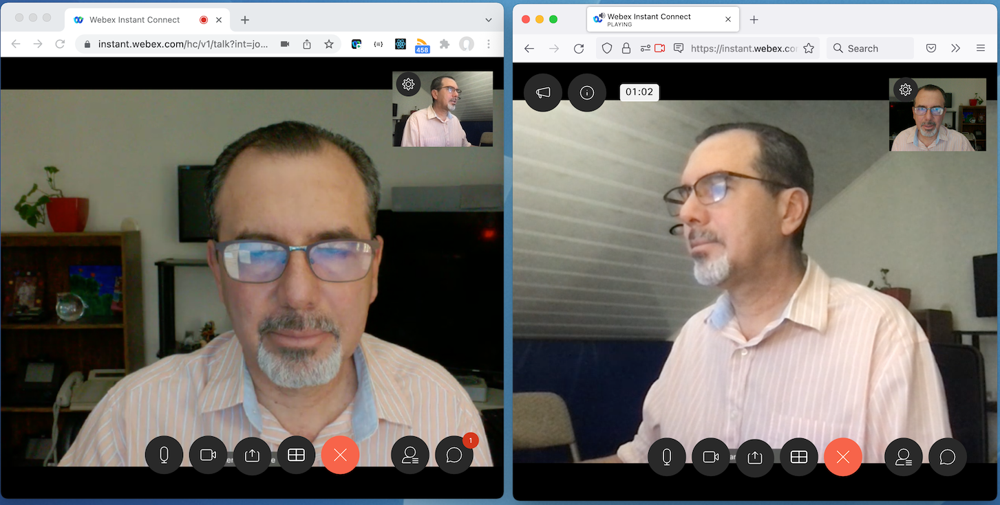
  
Notice both the patient and the provider can share their screen by selecting the icon with an rectangle with an arrow pointing up in the center.  

You added a WebexID to the consultation in the initial page of this sample and they join with their device, the session could look like this:  

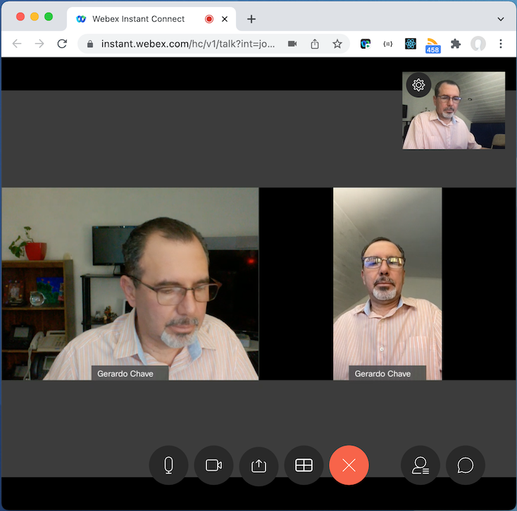

The image above is the perspective of the provider/host and the device joining is a mobile phone using the Webex App, but if it was a room/desk device it would look similar, the device shows up just as any other participant with the name of the owner of that device that is in Personal Mode.  

But you can also have just the device join the session and it would look like this:  

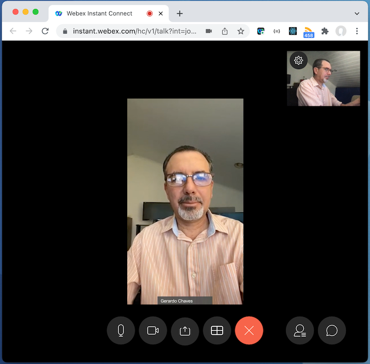  
  
NOTE: The provider always has to be the first to join the session for it to start, be it via the browser URL or by dialing into the session using the SIP URI from their personal device.  

If you add a Webex user to the session in the first page, you will be able to visualize the temporary space that was created for the consultation if you use a Webex App logged in with the credentials of that Webex user. Look for a space named "Virtual Visit - " plus the value of the "subject" you used with accessing the IC service to schedule a session and obtain the join URLs. If you did not modify that section of the sample code, that value will be whatever you put in to the *IC_BASE_SUBJECT* environment variable in the *.env* file. You will want to append to that value some unique identifier in your own version of the code to have the sample generate multiple distinct consultation sessions.  

You might have seen that the IC user interface gives patients and providers a chance to chat during the session , those messages (if any) would be shown in the space like for any other space a user belongs to:  

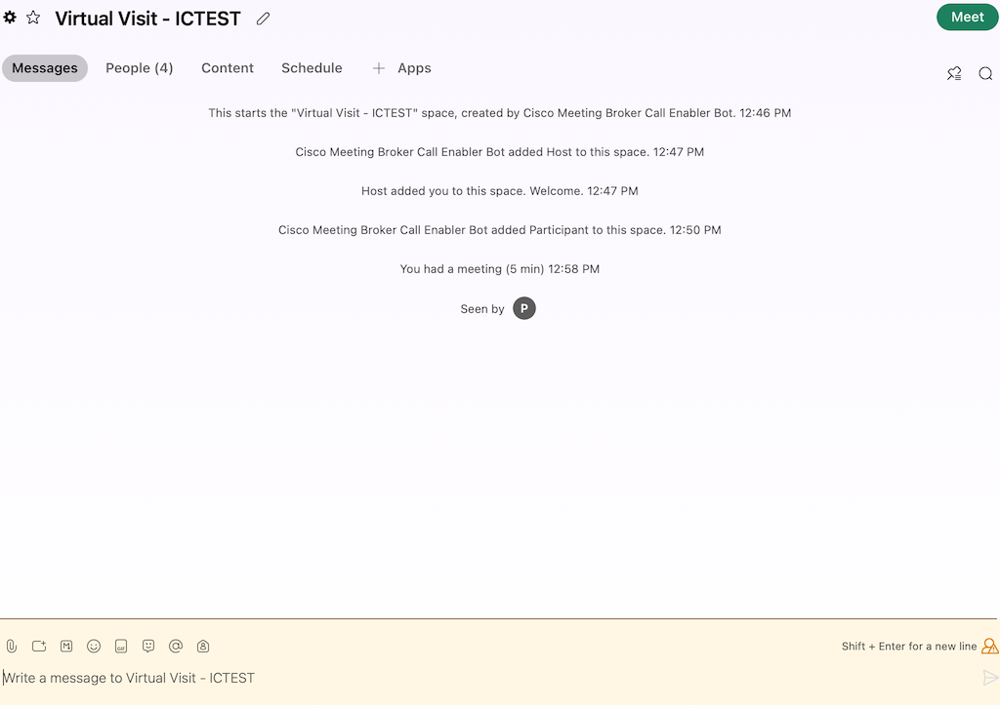

Notice that the members of that space include the Webex Guest Token users that the IC back end creates on the fly for each temporary space for a consultation plus any Webex users this sample code added in addition to the Webex Bot that IC created for your organization to manage the sessions:  

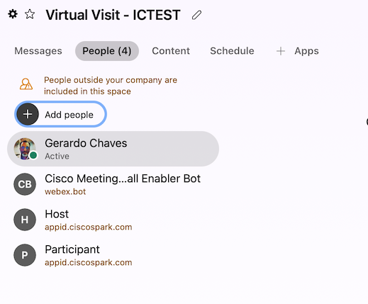

Once the provider or the patient hit the red button with an X to exit the consultation, if the session is still valid they will see the following in their browser since they still have a chance to re-join the session if they want:  

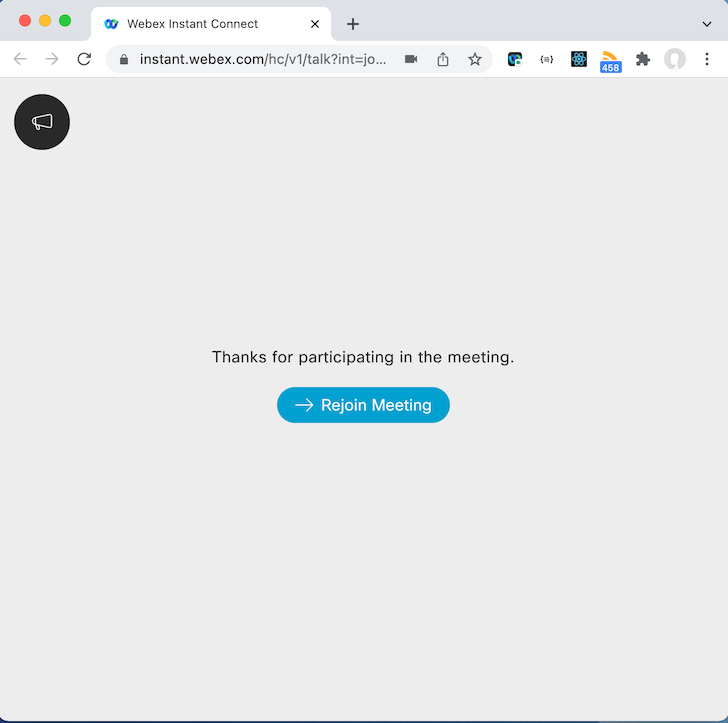


### LICENSE

Provided under Cisco Sample Code License, for details see [LICENSE](LICENSE.md)

### CODE_OF_CONDUCT

Our code of conduct is available [here](CODE_OF_CONDUCT.md)

### CONTRIBUTING

See our contributing guidelines [here](CONTRIBUTING.md)

#### DISCLAIMER:
<b>Please note:</b> This script is meant for demo purposes only. All tools/ scripts in this repo are released for use "AS IS" without any warranties of any kind, including, but not limited to their installation, use, or performance. Any use of these scripts and tools is at your own risk. There is no guarantee that they have been through thorough testing in a comparable environment and we are not responsible for any damage or data loss incurred with their use.
You are responsible for reviewing and testing any scripts you run thoroughly before use in any non-testing environment.
